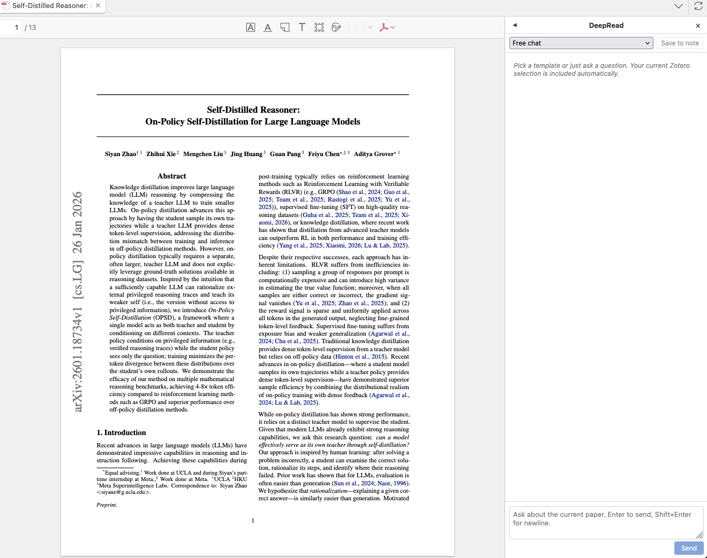
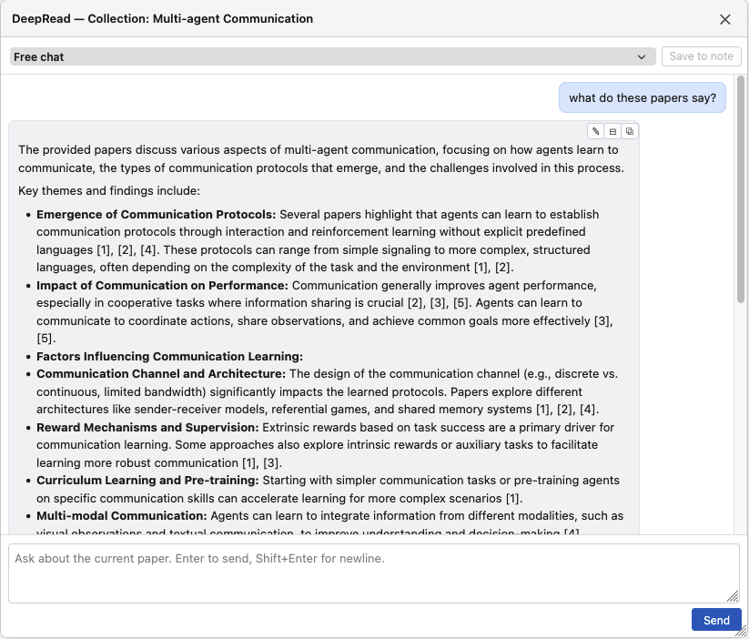
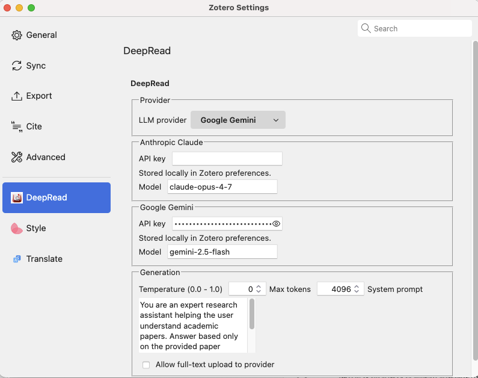

<p align="center">
  
</p>

<h1 align="center">DeepRead</h1>

DeepRead is a Zotero 7+ plugin that turns your library into a conversational research assistant. It adds an AI sidebar to the PDF reader, supports right-click "Ask DeepRead" on selected text, and provides collection-level retrieval-augmented chat over multiple papers.

All LLM calls go through your own API key. Choose Anthropic Claude or Google Gemini per provider preference.

> Status: working MVP. Tested on Zotero 9.x / macOS. Linux / Windows untested.

[](https://github.com/XiangweiW/deepread/actions/workflows/ci.yml) [](https://github.com/XiangweiW/deepread/releases)

## Screenshots

| Sidebar chat | Collection RAG overlay | Settings pane |
|---|---|---|
|  |  |  |

> Screenshots placeholder — capture pending. See [docs/screenshots/README.md](docs/screenshots/README.md) for capture instructions.

## Install

Grab the latest `.xpi` from [Releases](https://github.com/XiangweiW/deepread/releases). In Zotero: **Tools → Plugins → ⚙️ → Install Plugin From File** and pick the downloaded file.

### Use with Claude Code / Cursor / Codex CLI

DeepRead exposes an MCP server you can plug into any agentic IDE. Quick start:
1. Install the Zotero plugin (above) and turn on **Settings → DeepRead → Enable MCP server**.
2. In your IDE: `claude mcp add --scope user deepread -- npx -y deepread-mcp` (or use the one-click "Add to Cursor" button in the plugin's settings).

See [docs/MCP.md](docs/MCP.md) for full setup, the list of tools, and troubleshooting.

For development install (watch mode + rebuild), see [Install (development)](#install-development) below.

## Features

- **Works with Claude Code, Cursor, Codex CLI** — DeepRead ships an MCP server. Connect it to your favorite agentic IDE and read your Zotero library without an API key. See [docs/MCP.md](docs/MCP.md).
- **Single-paper chat** — sidebar in the PDF reader with streaming responses, prompt templates (summarize / translate to Chinese), free chat, and "save to note" to persist the transcript as a Zotero child note.
- **Right-click selected text → Ask DeepRead** — the PDF text-selection popup gets an extra button that explains the selection in the active sidebar.
- **Collection-level RAG** — right-click any collection and pick "Analyze with DeepRead". The plugin extracts, chunks, and embeds every paper, then opens a draggable / resizable floating chat where queries are answered with retrieval over the whole collection. Embeddings cached on disk; rebuilds are incremental.
- **Multi-provider** — Anthropic Claude and Google Gemini. Switch in Settings → DeepRead. Both use streaming.
- **Native Zotero preferences pane** — Settings → DeepRead exposes provider, API keys, model, temperature, max tokens, system prompt.
- **Collapsible sidebar** — click ◀ to collapse to a 32px bar, ▶ to expand.
- **Copy controls** — every assistant message has ✎ (raw text view), ⊟ (select all), ⧉ (copy whole message).

## Architecture overview

- TypeScript / React 18, bundled with esbuild into a single IIFE that Zotero's bootstrap loads via `Services.scriptloader.loadSubScript`.
- LLM provider abstraction (`src/llm/`) with streaming SSE parsers for Anthropic Messages API and Gemini `streamGenerateContent`.
- Context extraction (`src/context/`) reuses Zotero APIs for full text, selections, annotations, child notes.
- RAG (`src/rag/`) — paragraph-aware chunker (≈500 tokens / 100 overlap), Gemini `gemini-embedding-001` for embeddings, JSON-on-disk index per collection, cosine top-k retrieval.
- Reader integration polls `Zotero.Reader._readers` and injects a sidebar via direct DOM manipulation in the reader iframe.
- Collection chat is rendered as a draggable HTML overlay in the main window (no new browser window — avoids chrome / process-isolation issues on modern Firefox / Zotero).
  - MCP host (`packages/zotero-plugin/src/mcp-host/`) registers a JSON-RPC endpoint via `Zotero.Server.Endpoints` at `http://127.0.0.1:23119/deepread/mcp`. The `deepread-mcp` npm package is a tiny stdio↔HTTP bridge MCP clients spawn via `npx`.

See [PROJECT_BRIEF.md](PROJECT_BRIEF.md) for the full design rationale and module map.

## Install (development)

Prereqs: Zotero 7+ (tested on 9.0.1), Node 20+.

```
git clone https://github.com/XiangweiW/deepread.git
cd deepread
npm install
npm run build
```

Then link the build into your Zotero profile (macOS path shown):

```
PROFILE=~/Library/Application\ Support/Zotero/Profiles/<your-profile>.default
mkdir -p "$PROFILE/extensions/zotero-copilot@xiangweiw.dev"
cp -R build/* "$PROFILE/extensions/zotero-copilot@xiangweiw.dev/"
```

Add to `<profile>/user.js` (Zotero must be quit first):

```js
user_pref("xpinstall.signatures.required", false);
user_pref("extensions.autoDisableScopes", 0);
user_pref("extensions.enabledScopes", 15);
```

Restart Zotero. Plugin should appear under **Tools → Plugins** as DeepRead.

For build / packaging details and a manual test checklist, see [docs/DEVELOPMENT.md](docs/DEVELOPMENT.md) and [docs/TESTING.md](docs/TESTING.md).

## Configuration

Open **Settings → DeepRead** (Mac: Zotero → Settings) and set:

- **Provider**: Anthropic Claude or Google Gemini
- **API key** for the active provider
- **Model**: e.g. `gemini-2.5-flash` (free tier) or `claude-opus-4-7`
- **System prompt**, **temperature**, **max tokens**
- **Allow full-text upload** — when off, only your selection / abstract is sent

API keys are stored locally in Zotero preferences (`extensions.zotero-copilot.*`) and never leave your machine except when calling the provider.

## Privacy

- The plugin only calls the provider you configure. No telemetry.
- For collection RAG, the entire chunked text of selected papers is sent to the embedding API. Disable "Allow full-text upload" if you only want metadata-level analysis.
- Sensitive collections: keep the toggle off and the plugin will fall back to title + abstract.

## Limitations

- Drag-to-select inside chat bubbles is unreliable in Zotero's chrome iframe; use the toolbar buttons (`✎` / `⊟` / `⧉`) for copying.
- Collection RAG requires Zotero to have full-text indexed the PDFs. The plugin will trigger `Zotero.Fulltext.indexItems` automatically, but first-run indexing of a large collection can take several minutes.
- Gemini free tier has rate limits on `generate_content` for some models. `gemini-2.5-flash` and the Gemma family generally work; older `gemini-2.0-flash` may not on free accounts.

## Acknowledgements

Built with Claude Code as a pair-programmer, scaffolded with prompts inspired by [windingwind/zotero-plugin-template](https://github.com/windingwind/zotero-plugin-template).

Monorepo: `packages/{shared, zotero-plugin, mcp-server}`.

## License

MIT — see [LICENSE](LICENSE).
